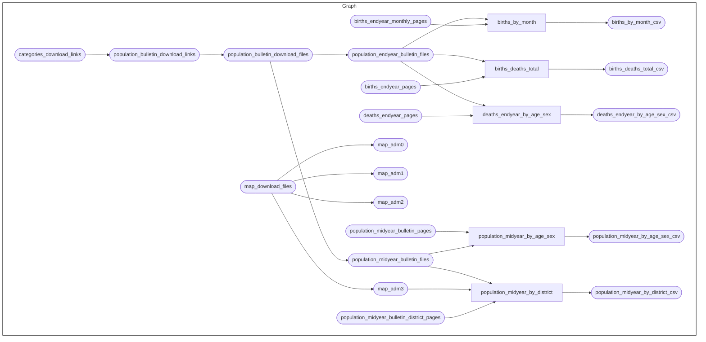

# seystats: Curating Seychelles data and statistics from publicly-available sources

[](https://www.repostatus.org/#active)
[-GPL3.0-blue.svg)](https://opensource.org/licenses/gpl-3.0.html)
[-CC_BY_4.0-blue)](https://creativecommons.org/licenses/by/4.0/)
[-CC0-blue)](https://creativecommons.org/public-domain/cc0/)
[](https://github.com/OxfordIHTM/seychelles-statistics/actions/workflows/test-workflow.yaml)

This repository is a
[`docker`](https://www.docker.com/get-started)-containerised,
[`{targets}`](https://docs.ropensci.org/targets/)-based,
[`{renv}`](https://rstudio.github.io/renv/articles/renv.html)-enabled
[`R`](https://cran.r-project.org/) workflow for the `seystats` project
on curating Seychelles data and statistics from various
publicly-available sources.

## About the project

In 2022, the **Seychelles-Oxford Partnership** on research capacity
building leveraged the vast research experience and skills of University
of Oxford research partners for training and upskilling data analysts
from the Ministry of Health (MOH) Seychelles.

From this process, the partnership identified that while the Seychelles
is one of the few sub-Saharan African countries with efficient,
accurate, and comprehensive data collection and disaggregation across a
variety of sectors and across a variety of metrics, most of this data
are not in the format, shape, and structure that are ready for analysis.
A good amount of these rich data are still on paper or ledgers. For the
data that are electronic, they are either stored/distributed in formats
that are not readily readable by machines for analysis (e.g., portable
document format or PDF) or are in proprietary spreadsheet format
(i.e. Microsoft Excel) structured into presentational tables meant for
reports rather than for actual analysis.

It is from this context that the initial ideas and motivation around
this project began. The partnership involves mostly individuals whose
roles and responsibilities were related to health. As such, ad hoc plans
prioritised health-related data. During this time, rough and informal
plans were drawn as to how the various steps will be implemented and how
the different technologies required will be resourced. Alongside these,
ongoing capacity-building on data management and analysis related to
research continued continued within the partnership.

By 2025, three years on from the start of the partnership, very little
has progressed and been implemented from these informal, ad hoc plans
whilst the partnership continued to more research capacity-building
focusing on other types of research skills (e.g. qualitative research),
on student placement projects for University of Oxford Masters students,
and other research efforts (e.g. cancer screening, cancer awareness,
cancer quality-of-care). During this period and in all these activities,
the same challenges and issues related to data identified in 2022 keep
propping up.

It is within this background that the `seystats` project is being
(re-)launched. The current motivation is to try to get moving in a more
productive direction on the ideas generated in 2022 and to be able to
demonstrate the stated advantages of data that is accessible,
persistent, and machine-readable/machine-actionable to catalysing
research efforts in Seychelles.

## Repository Structure

The project repository is structured as follows:

    seystats
        |-- .git-crypt/
        |-- .github/
        |-- auth/
        |-- data/
        |-- maps/
        |-- outputs/
        |-- pdf/
        |-- R/
        |-- renv
        |-- reports
        |-- schema/
        |-- _targets.R
        |-- .env
        |-- .gitattributes
        |-- .Rprofile
        |-- packages.R
        |-- renv.lock

  - `.git-crypt/` contains `git-crypt` software specific files to manage
    encryption of specific files and folders in the repository.

  - `.github` contains project testing and automated deployment of
    outputs workflows via continuous integration and continuous
    deployment (CI/CD) using Github Actions.

  - `auth` contains encrypted authentication keys used in this project.

  - `data/` contains intermediate and final data outputs produced by the
    workflow.

  - `maps/` contains Seychelles map data files downloaded by the
    workflow.

  - `outputs/` contains compiled reports and figures produced by the
    workflow.

  - `pdf/` contains PDF files downloaded by the workflow for data
    extraction.

  - `R/` contains functions developed/created specifically for use in
    this workflow.

  - `renv/` contains `renv` package specific files and directories used
    by the package for maintaining R package dependencies within the
    project. The directory `renv/library`, is a library that contains
    all packages currently used by the project. This directory, and all
    files and sub-directories within it, are all generated and managed
    by the `renv` package. Users should not change/edit these manually.

  - `reports/` contains literate code for R Markdown and/or Quarto
    reports rendered in the workflow.

  - `schema/` contains `.sql` code used for creating and deploying the
    project SQL database in DoltHub.

  - `_targets.R` file defines the steps in the workflow’s data ingest,
    data processing, data analysis, and reporting pipeline.

  - `.env` is an encrypted file that contains environment variables used
    in this project.

  - `.gitattributes` file contains information used by `git-crypt` to
    determine which files and/or folders in the repository to encrypt.

  - `.Rprofile` file is a project R profile generated when initiating
    `renv` for the first time. This file is run automatically every time
    R is run within this project, and `renv` uses it to configure the R
    session to use the `renv` project library.

  - `packages.R` file lists out all R package dependencies required by
    the workflow.

  - `renv.lock` file is the `renv` lockfile which records enough
    metadata about every package used in this project that it can be
    re-installed on a new machine. This file is generated by the `renv`
    package and should not be changed/edited manually.

## Reproducibility

### R version

This project was built using `R 4.5.1`. To manage R versions, it is
recommended to use [`rig`](https://github.com/r-lib/rig) - an R
installation manager - to be able to install multiple versions of R and
switch between them as needed.

### R package dependencies

This project uses the `{renv}` framework to record R package
dependencies and versions. Packages and versions used are recorded in
`renv.lock` and code used to manage dependencies is in the `renv`
directory and other files in the root project directory.

On starting an R session in the working directory of this repository,
first run

``` r
renv::restore()
```

to install R package dependencies.

### Encryption

This project uses encrypted environment variables and authentication
keys for data retrieval managed using
[`git-crypt`](https://github.com/AGWA/git-crypt). Collaborators will
need to [install `git-crypt`](https://github.com/AGWA/git-crypt) and
then provide their GPG key to the authors to be added as an authorised
user within the repository. To get a GPG key, [download and install
GPG](https://www.gnupg.org/download/) and then [generate your GPG key
pair](https://www.gnupg.org/gph/en/manual/c14.html). Then provide your
GPG key id to the authors.

Once given permission into the project and GPG key id added to the
repository, update your local version of the repository by doing a `git
pull` and then unlock the encrypted files/folders of the repository by
running the following command in Terminal from within the project
directory:

``` bash
git-crypt unlock
```

The encrypted components of the repository will now be decrypted and
accessible for running the workflow (described below).

### The workflow

The current workflow has the following steps:



To run the workflow, issue the following command in R from within the
project directory

``` r
targets::tar_make()
```

or issue the following command in Terminal from within the project
directory

``` bash
Rscript -e  "targets::tar_make()"
```

## Collaborators

  - Prof. Proochista Ariana
  - Dr. Sanjeev Pugazhendhi
  - Ituen Williams-Umanah
  - Ned Rosalie
  - Keddy Woodcock
  - Dr. Sylvie Pool
  - Dr. Johanna Rapanarilala
  - Dr. Giri Rajaram
  - Dr. Bushra Naz
  - Dr. Yih Seong Wong
  - Anita Makori
  - Dr. Jillian Francise Lee
  - Neira Budiono
  - Dr. Nyasha Manyeruke
  - Dr. Ibrahim Ajami
  - Dr. Ernest Guevarra

## License

All code in this project is released under a
[GPL-3.0](https://www.gnu.org/licenses/gpl-3.0.en.html#license-text)
license. All text in this project is released under a
[CC-BY-4.0](https://creativecommons.org/licenses/by/4.0/deed.en)
license. Data is released under a
[CC0](https://creativecommons.org/public-domain/cc0/) license.

## Community guidelines

Feedback, bug reports and feature requests are welcome; file issues or
seek support [here](https://github.com/OxfordIHTM/seystats/issues). If
you would like to contribute to the project, please see our
[contributing
guidelines](https://oxford-ihtm.io/codigo/CONTRIBUTING.html).

This project is released with a [Contributor Code of
Conduct](https://oxford-ihtm.io/codigo/CODE_OF_CONDUCT.html). By
participating in this project you agree to abide by its terms.
